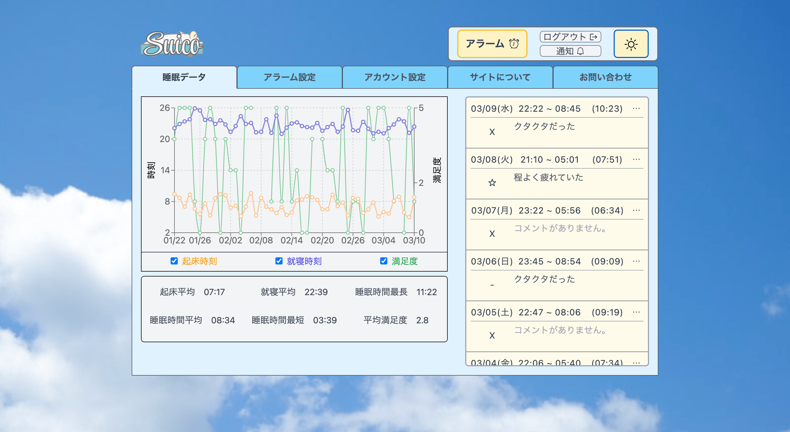
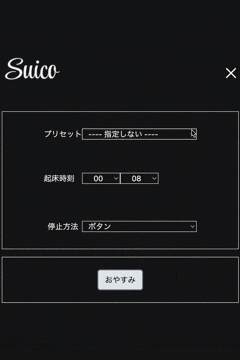
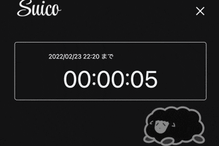
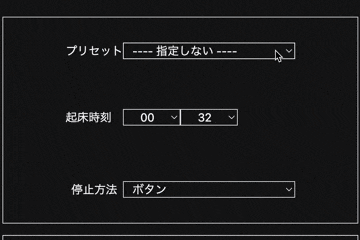
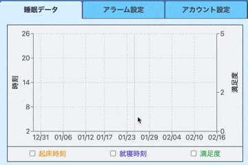
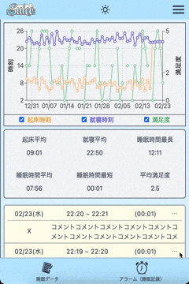
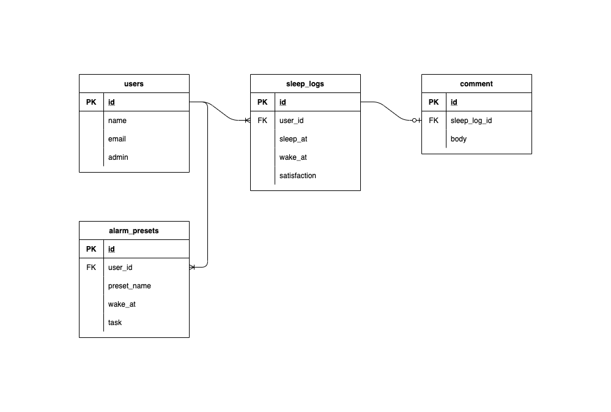

# Suico（3/30をもちまして公開終了しました。）

 

# 概要
ご覧いただき誠にありがとうございます。

このアプリケーションは、睡眠の改善を目的として作成したアプリケーションです。

睡眠を記録してグラフ化したり、平均のデータを確認することで生活リズムの乱れや睡眠の不満を発見して改善につなげることを目標としています。
 
 

# アプリを作成した経緯
私は以前、鉄道会社で電車の運転士をしていました。終電や始発電車を運行するために3~4時間という短い仮眠時間しか眠れなかったり、泊まり勤務を伴うために発生する不規則な生活リズムを繰り返すことで __睡眠に関する悩み__ を抱くようになりました。
 
 
調べてみると、私と同じ様に多くの日本人が睡眠に関する悩みを抱えていることがわかりました。
 
[日本人の7割が睡眠不足？ 親子で知りたい、睡眠のリズムを整えるコツ](https://www.asahi.com/edua/article/14412470 )
 
 
アプリ開発を通して睡眠に関する悩みを解決したい、生活の改善に役立ちたいと感じたためSuicoを開発することにしました。
 
 

# 機能紹介
主要な機能を紹介いたします。
 
 

## アラーム機能
起きたい時間とアラームを止める方法を選んで、アラームを設定できます。
 
 

 
 

## アラームの停止
アラームは、起床ボタンを押すことで停止できます。
 
 

 
 

しかし、_「停止させてすぐに二度寝してしまうかも…」_ 
 
 
そんな方に向けて二度寝を防止するために、
- __「かんたんな計算問題を解く」__
- __「順番にパネルを選択する」__  

という2種類のミニゲームを用意しております。
 
 
停止方法でミニゲームを設定した場合は、ゲームをクリアするまで起床ボタンが表示されません。
 
 

## かんたんな計算問題を解く
ランダムで数問、計算問題が出題されます。寝起きの状態で数字を入力しなくても、用意された3択のパネルから解答を選べるようにしています。 
 

 
 

## パネル選択問題
パネルが複数枚表示されます。1から順番に選択しないとクリアになりません。配置も枚数もランダムとなっております。
 
 

 
 

## アラームプリセット機能
作成したアラームプリセットを使用して、アラームが鳴る時間や停止方法をすぐに設定することができます。
 
 

 
 

## 睡眠グラフ
記録してある睡眠の「就寝時間」「起床時間」「満足度」をグラフとして見ることができます。
 
 

 
 

## レスポンシブ対応・ダークモード切替
利便性を高めるため、レスポンシブ対応を行っております。また、目に対する刺激を抑えるため、ダークモードに対応しています。
 
 
ご利用の端末がダークモードに設定されている場合、最初からダークモードの配色で表示されます。通常画面とダークモード画面を切り替えられるように、画面上部に切り替えボタンを設置しております。
 
 

 
 

# 使用技術など
## フロントエンド
- React(17.0.2)
- React hooks
- TypeScript
- TailwindCSS

## バックエンド
- Ruby on Rails(6.1.4.4)

## DB
- MySQL(8.0)

## 開発環境、インフラ
- Docker
- docker-compose
- CircleCI
- AWS(ECS(EC2), ECR, Route53, S3, CloudFront, RDS)
- terraform(バックエンドの構成に使用)
 
 

# テスト、静的コード解析
## フロントエンド
- ESLint
## バックエンド
- RSpec
- Rubocop
 
 

# 開発において意識している点
- フロントエンドの完全SPA化
  React, React hooksを使用して、フロントエンドは完全SPA化しています。
- 新たな技術への挑戦
  最初はRuby on Rails単体でアプリケーション開発に挑戦していましたが、SPA化やTypeScriptの学習、開発環境のDocker化に挑戦してみました。
- 疑似的にチーム開発を意識
  git-flowを実践したり、githubのIssueを活用し、チーム開発を意識した個人開発に挑戦しています。
 

# デザイン
デザインはfigmaで考案・作成しました。以下のリンクからワイヤーフレーム・ロゴ画像・デザインカンプなどをご覧いただけます。
 
 
<a href="https://www.figma.com/file/RS0YfHW0mLr1LVbpMn3niw/Suico">Suicoデザインカンプ</a>
 
 

# ER図

 
 

# 機能一覧
## ユーザー機能
- 新規登録、ログイン、ログアウト、ゲストログイン

## 睡眠に関する機能
- 睡眠記録の一覧表示
- 睡眠記録の編集、削除
- 睡眠記録の起床平均、就寝平均、最長時間、平均時間、最短時間、平均満足度の表示
- 睡眠の記録のグラフ化、グラフに表示する項目の選択

## アラームに関する機能
- アラーム
- アラーム終了時のタスク設定(かんたんな計算を解く、パネルを順番に選択)
- アラームプリセットの適用
- アラームプリセットの作成、編集
- アラーム機能に関連して睡眠時間の記録、睡眠の満足度の記録

## 画面に関する機能
- ダークモード対応
- レスポンシブ対応

## これから作成予定の機能
- アカウント設定機能
- お問い合わせ機能
- 通知機能
 
 

__最後までご覧いただきありがとうございました。__
